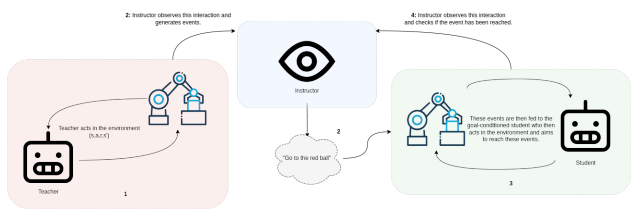
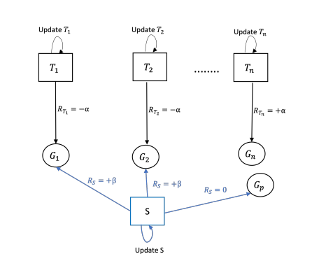
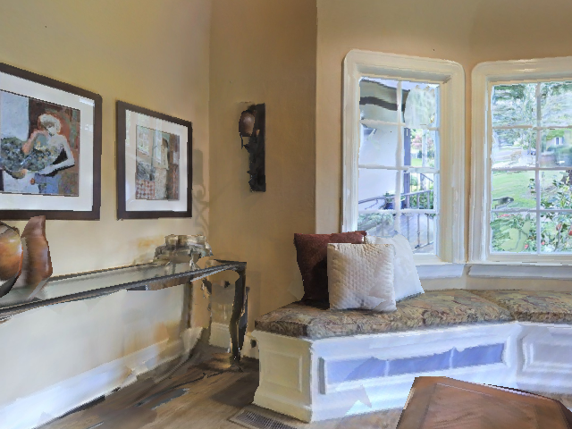
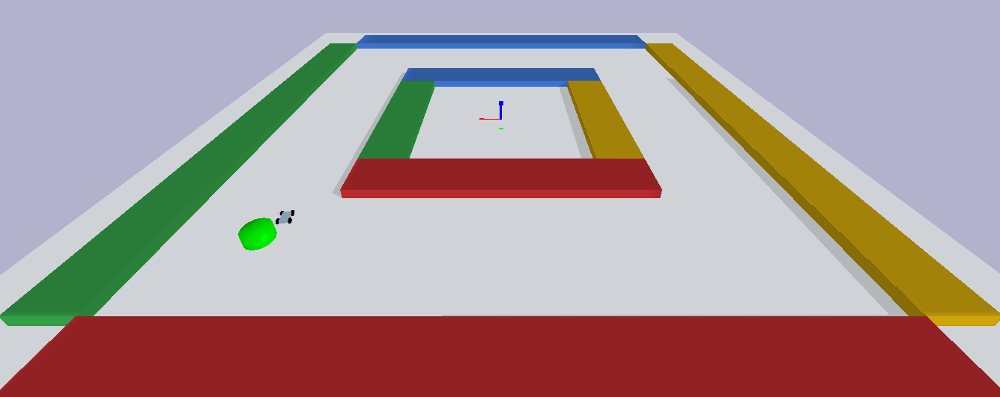
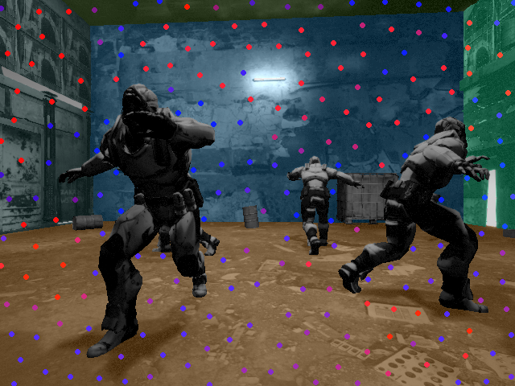

## 2024

<table>
  <tr>
    <td>
     
    </td>
    <td>
    <b style="color:rgb(230, 74, 255)">GLIDE-RL: Grounded Language Instruction through DEmonstration in RL</b>   
    <b>(Extended Abstract Accepted in AAMAS'24)</b>  
    <strong>Chaitanya Kharyal</strong>, Sai Krishna Gottipati, Tanmay Kumar Sinha, Srijita Das, Matthew E. Taylor
    </td>
  </tr>
  <tr>
    
  </tr>
</table>

## 2022

<table>
  <tr>
    <td>
     
    </td>
    <td>
    <b style="color:rgb(230, 74, 255)">Do As You Teach: A Multi-Teacher Approach to Self-Play in Deep Reinforcement Learning</b>   
    <b>(NeurIPS'22 DRL workshop)</b>  
    <strong>Chaitanya Kharyal</strong>, Tanmay Kumar Sinha, SaiKrishna Gottipati, Srijita Das, Matthew E. Taylor
    </td>
  </tr>
  <tr>
    <td>
    
    </td>
    <td>
    <b style="color:rgb(230, 74, 255)">Spatial Relation Graph and Graph Convolutional Network for Object Goal Navigation</b>   
    <b>(CASE'22)</b>  
    D. A. Sasi Kiran, <strong>Chaitanya Kharyal</strong>, K. Anand , G. Kumar, N. Gireesh, S. Banerjee, R. dev Roychoudhury, M. Sridharan, B. Bhowmick, M. Krishna
    </td>
  </tr>
  <tr>
    <td>
     
    </td>
    <td>
    <b style="color:rgb(230, 74, 255)">Multi-Teacher Curriculum Design for Sparse Reward Environments</b>   
    <b>(ALA workshop At AAMAS'22)</b>  
    <strong>Chaitanya Kharyal</strong>, Tanmay K. Sinha, Matthew E. Taylor
    </td>
  </tr>
  <tr>
    
  </tr>
</table>

## 2021

<table>
  <tr>
    <td>
     
    </td>
    <td>
    <b style="color:rgb(230, 74, 255)">RP-VIO: Robust Plane-based Visual-Inertial Odometry for Dynamic Environments</b>   
    <b>(Accepted in IROS'21)</b>  
    Karnik Ram, <strong>Chaitanya Kharyal</strong>, Sudarshan S. Harithas, K. Madhava Krishna
    </td>
  </tr>
  <tr>
    
  </tr>
</table>

<!-- |img | [RP-VIO: Robust Plane-based Visual-Inertial Odometry for Dynamic Environments](https://arxiv.org/abs/2103.10400)

- [RP-VIO: Robust Plane-based Visual-Inertial Odometry for Dynamic Environments](https://arxiv.org/abs/2103.10400)
    - [Karnik Ram](https://github.com/karnikram), Chaitanya Kharyal, [Sudarshan S. Harithas](https://github.com/sudarshan-s-harithas), [K. Madhava Krishna](https://faculty.iiit.ac.in/~mkrishna/) -->